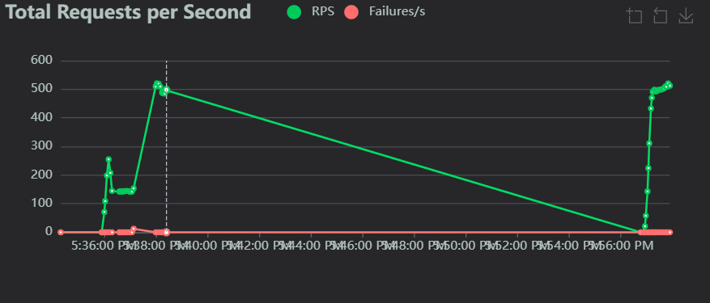
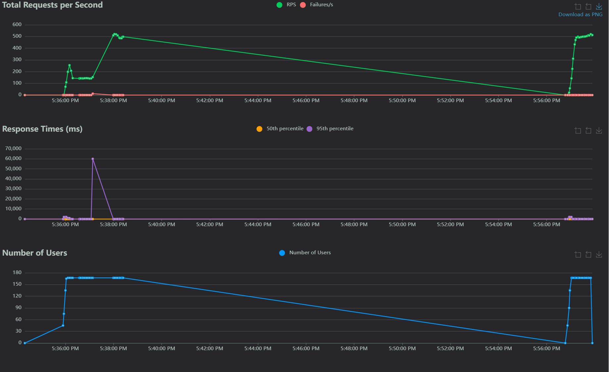

# Notification API

This project is a Notification API built with FastAPI to send notifications via different channels such as Email, SMS, and WhatsApp. The API uses external services for sending notifications and is designed to be easily extensible for integrating other services in the future.

## Features
- Sends email notifications using Mailgun (or any email service).
- The code is structured to easily add more notification services like SMS and WhatsApp.
- Asynchronous, non-blocking email sending to handle high-volume requests.
- API requests are processed in a multi-threaded manner for better scalability.
- **Batch Notification**: Send multiple notifications in a single request for improved efficiency.

## Installation

### Prerequisites
- Python 3.8 or later
- FastAPI
- Uvicorn
- Other dependencies listed in `requirements.txt`

### Steps to Set Up and Run

1. **Clone the repository**:
    ```bash
    git clone https://github.com/kanishka231/notification_api
    cd notification_api
    ```

2. **Set up a virtual environment**:
    If you haven't installed `virtualenv`, you can do so using pip:
    ```bash
    pip install virtualenv
    ```

    Create a virtual environment:
    ```bash
    python -m venv venv
    ```

3. **Activate the virtual environment**:
    - On Windows:
        ```bash
        venv\Scripts\activate
        ```
    - On macOS/Linux:
        ```bash
        source venv/bin/activate
        ```

4. **Install dependencies**:
    ```bash
    pip install -r requirements.txt
    ```

5. **Configure the `.env` file**:
    - Create a `.env` file in the root of your project.
    - Add your Mailgun SMTP credentials in the `.env` file:
    ```
    SMTP_HOST=smtp.mailgun.org
    SMTP_PORT=587
    SMTP_USER=postmaster@sandbox8ac792fc3a834a67bfddfcc382207a07.mailgun.org
    SMTP_PASS=your_smtp_password
    ```

6. **Run the FastAPI app**:
    ```bash
    uvicorn app.main:app --reload
    ```

    The FastAPI app will start running on `http://127.0.0.1:8000`.

7. **Test the API**:
    - Use Thunder Client, Postman, or any HTTP client to test the API by sending a POST request to `http://127.0.0.1:8000/send-notification/` with the following JSON body:
    ```json
    {
      "client_id": "client123",
      "recipient": "abc@gmail.com",
      "channel": "email",
      "message": "Your package has been shipped.",
      "package_status": "shipped"
    }
    ```

    - The expected response will be:
    ```json
    {
      "message": "Notification for abc@gmail.com is being processed."
    }
    ```

8. **Verify the email notification**:
    - Check the recipient's email inbox to confirm the notification is delivered.

## Batch Notification Feature

The Notification API now supports sending notifications in batches, allowing you to send multiple notifications in a single request. This feature is designed to improve efficiency and scalability, especially when dealing with high-volume notification requirements.

### Batch Notification Endpoint

- **Endpoint**: `/send-batch-notification/`
- **Method**: `POST`
- **Description**: Sends multiple notifications in a single request.

### Request Body

The request body should contain a JSON object with an array of notifications. Each notification should include the following fields:

```json
{
  "notifications": [
    {
      "client_id": "client123",
      "recipient": "abc@gmail.com",
      "channel": "email",
      "message": "Your package has been shipped.",
      "package_status": "shipped"
    },
    {
      "client_id": "client123",
      "recipient": "xyz@gmail.com",
      "channel": "email",
      "message": "Your package has been delivered.",
      "package_status": "delivered"
    }
  ]
}
```

## Example Request

You can test the batch notification feature using an HTTP client like Postman or Thunder Client. Here’s an example of how to send a batch notification request:

POST http://127.0.0.1:8000/send-batch-notification/
Content-Type: application/json

```json
{
  "notifications": [
    {
      "client_id": "client123",
      "recipient": "abc@gmail.com",
      "channel": "email",
      "message": "Your package has been shipped.",
      "package_status": "shipped"
    },
    {
      "client_id": "client123",
      "recipient": "xyz@gmail.com",
      "channel": "email",
      "message": "Your package has been delivered.",
      "package_status": "delivered"
    }
  ]
}
```

### Expected Response

The expected response will indicate that all notifications are being processed:

```json
{
  "message": "All notifications are being processed."
}
```

## Locust Load Testing

To ensure your API can handle a high volume of requests (such as 10,000 requests per minute), we can use **Locust** to perform load testing.

### Steps to Run Locust Tests

1. **Install Locust**:
    ```bash
    pip install locust
    ```

2. **Create a `locustfile.py`** in the root directory of your project with the following code:

```python
from locust import FastHttpUser, task, between

class UserBehavior(FastHttpUser):
    wait_time = between(0.1, 0.5)  # Random wait time between 0.1 and 0.5 seconds

    @task
    def send_notification(self):
        response = self.client.post("/send-notification/", json={
           "client_id": "client123",
           "recipient": "sbdfh@hdsf",
           "channel": "email",
           "message": "Your package has been shipped.",
           "package_status": "shipped"
        })
        print(f"Response status: {response.status_code}, Response body: {response.text}")
```

3. **Run Locust**:
    ```bash
    locust -f locustfile.py --host=http://127.0.0.1:8000
    ```

4. **Open Locust Web Interface**:
    Once Locust starts, open `http://localhost:8089` in your browser.

5. **Configure Test Settings**:
    - **Number of Users:** Set to 167 (to simulate 167 concurrent users).
    - **Spawn Rate:** Set to 15 users/second.
    - Start the test and observe the results in the web interface.

6. **Check the Results**:
    - The **Total Requests/Sec** value should exceed **167 RPS**, indicating that your API can handle 10,000 requests per minute.
    - Monitor response times and failure rates to ensure everything is functioning smoothly.

### Locust File Location:
- **File**: `locustfile.py` should be placed in the root directory of your project.

---

## Directory Structure

```
notification_api/
│
├── app/
│   ├── config.py          # Contains the configuration like SMTP settings
│   ├── main.py            # FastAPI app definition
│   ├── models.py          # Pydantic models for request validation
│   ├── services/          # Contains different notification services (Email, SMS, etc.)
│   │   └── mock_email_service.py   # Mock email service for testing
│   ├── managers/          # Contains logic for managing notification services
│   └── tasks.py           # Contains the task to send emails in a non-blocking way
│
├── locustfile.py          # Locust test file for load testing
├── requirements.txt       # List of Python dependencies
└── .env                   # Environment variables for sensitive information
```

## Future Improvements
- Integrate other notification channels like SMS and WhatsApp.
- Implement rate-limiting to avoid abuse and ensure optimal performance under high load.
- Add authentication to secure the API endpoints.
- Create more flexible and reusable notification handling logic.

### Screenshot of results



